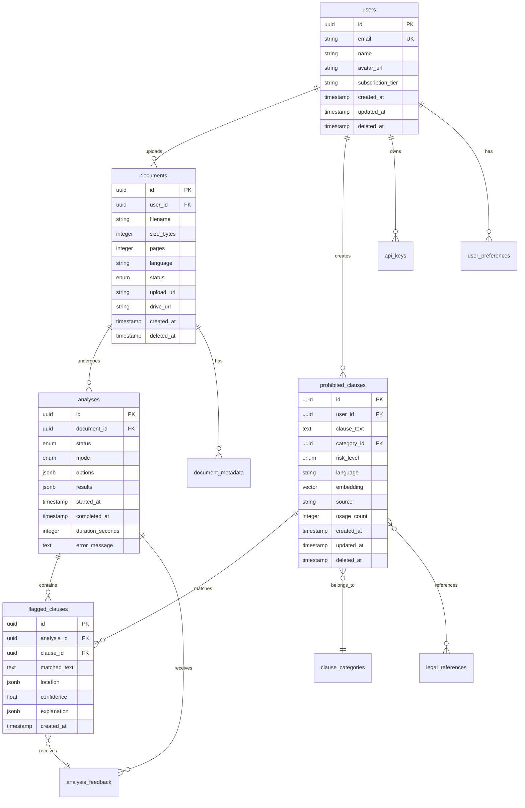

# FairPact - Database Schema v1.0

## Document Information
- **Version:** 1.0
- **Last Updated:** 2025-12-08
- **Database:** PostgreSQL 15+
- **Extensions:** pgvector, uuid-ossp, pg_trgm
- **Related Documents:** [Implementation Plan](./implementation_plan_v2.md), [API Specification](./api_specification.md)

---

## Table of Contents
1. [Overview](#1-overview)
2. [Schema Diagram](#2-schema-diagram)
3. [Tables](#3-tables)
4. [Indexes](#4-indexes)
5. [Triggers & Functions](#5-triggers--functions)
6. [Migrations](#6-migrations)
7. [Data Seeding](#7-data-seeding)

---

## 1. Overview

### Design Principles
- **Normalization:** 3NF for transactional data
- **Denormalization:** Vector embeddings stored with clauses for performance
- **Soft Deletes:** Critical tables use `deleted_at` instead of hard deletes
- **Auditing:** Timestamps (`created_at`, `updated_at`) on all tables
- **UUID Primary Keys:** For security and distributed systems compatibility

### Extensions Required

```sql
CREATE EXTENSION IF NOT EXISTS "uuid-ossp";      -- UUID generation
CREATE EXTENSION IF NOT EXISTS "pgvector";       -- Vector similarity search
CREATE EXTENSION IF NOT EXISTS "pg_trgm";        -- Trigram text search
```

---

## 2. Schema Diagram



---

## 3. Tables

### 3.1 users

Stores user account information.

```sql
CREATE TABLE users (
    id UUID PRIMARY KEY DEFAULT uuid_generate_v4(),
    email VARCHAR(255) NOT NULL UNIQUE,
    name VARCHAR(255),
    avatar_url TEXT,

    -- Subscription
    subscription_tier VARCHAR(50) NOT NULL DEFAULT 'free',
    subscription_status VARCHAR(50) DEFAULT 'active',
    subscription_expires_at TIMESTAMP WITH TIME ZONE,

    -- OAuth
    google_id VARCHAR(255) UNIQUE,
    google_refresh_token TEXT,

    -- Usage tracking
    analyses_this_month INTEGER DEFAULT 0,
    quota_reset_at TIMESTAMP WITH TIME ZONE DEFAULT (date_trunc('month', CURRENT_TIMESTAMP) + interval '1 month'),

    -- Metadata
    created_at TIMESTAMP WITH TIME ZONE DEFAULT CURRENT_TIMESTAMP,
    updated_at TIMESTAMP WITH TIME ZONE DEFAULT CURRENT_TIMESTAMP,
    deleted_at TIMESTAMP WITH TIME ZONE,
    last_login_at TIMESTAMP WITH TIME ZONE,

    CONSTRAINT valid_subscription_tier CHECK (
        subscription_tier IN ('free', 'pro', 'enterprise', 'guest')
    )
);

-- Indexes
CREATE INDEX idx_users_email ON users(email) WHERE deleted_at IS NULL;
CREATE INDEX idx_users_google_id ON users(google_id) WHERE google_id IS NOT NULL;
CREATE INDEX idx_users_subscription ON users(subscription_tier, subscription_status);
```

---

### 3.2 user_preferences

User settings and preferences.

```sql
CREATE TABLE user_preferences (
    id UUID PRIMARY KEY DEFAULT uuid_generate_v4(),
    user_id UUID NOT NULL REFERENCES users(id) ON DELETE CASCADE,

    -- Preferences
    language VARCHAR(10) DEFAULT 'pl',
    default_analysis_mode VARCHAR(20) DEFAULT 'offline',
    email_notifications BOOLEAN DEFAULT true,
    theme VARCHAR(20) DEFAULT 'light',

    -- Notifications
    notify_on_completion BOOLEAN DEFAULT true,
    notify_on_high_risk BOOLEAN DEFAULT true,

    created_at TIMESTAMP WITH TIME ZONE DEFAULT CURRENT_TIMESTAMP,
    updated_at TIMESTAMP WITH TIME ZONE DEFAULT CURRENT_TIMESTAMP,

    CONSTRAINT fk_user_preferences_user FOREIGN KEY (user_id)
        REFERENCES users(id) ON DELETE CASCADE,
    CONSTRAINT unique_user_preferences UNIQUE(user_id)
);
```

---

### 3.3 api_keys

API keys for third-party integrations.

```sql
CREATE TABLE api_keys (
    id UUID PRIMARY KEY DEFAULT uuid_generate_v4(),
    user_id UUID NOT NULL REFERENCES users(id) ON DELETE CASCADE,

    -- Key data
    key_hash VARCHAR(255) NOT NULL UNIQUE,
    key_prefix VARCHAR(20) NOT NULL, -- First 8 chars for display
    name VARCHAR(255) NOT NULL,

    -- Permissions
    scopes TEXT[] DEFAULT ARRAY['read:documents', 'write:documents'],

    -- Rate limiting
    rate_limit_per_minute INTEGER DEFAULT 60,

    -- Status
    is_active BOOLEAN DEFAULT true,
    last_used_at TIMESTAMP WITH TIME ZONE,
    expires_at TIMESTAMP WITH TIME ZONE,

    created_at TIMESTAMP WITH TIME ZONE DEFAULT CURRENT_TIMESTAMP,
    revoked_at TIMESTAMP WITH TIME ZONE,

    CONSTRAINT fk_api_keys_user FOREIGN KEY (user_id)
        REFERENCES users(id) ON DELETE CASCADE
);

CREATE INDEX idx_api_keys_hash ON api_keys(key_hash) WHERE is_active = true;
CREATE INDEX idx_api_keys_user ON api_keys(user_id);
```

---

### 3.4 documents

Uploaded documents for analysis.

```sql
CREATE TABLE documents (
    id UUID PRIMARY KEY DEFAULT uuid_generate_v4(),
    user_id UUID REFERENCES users(id) ON DELETE SET NULL,

    -- File metadata
    filename VARCHAR(255) NOT NULL,
    original_filename VARCHAR(255) NOT NULL,
    size_bytes BIGINT NOT NULL,
    pages INTEGER,
    mime_type VARCHAR(100) NOT NULL,

    -- Language & processing
    language VARCHAR(10) DEFAULT 'pl',
    status VARCHAR(50) NOT NULL DEFAULT 'uploaded',

    -- Storage
    upload_url TEXT NOT NULL,
    drive_file_id VARCHAR(255),
    drive_url TEXT,

    -- OCR metadata
    ocr_required BOOLEAN DEFAULT false,
    ocr_completed BOOLEAN DEFAULT false,
    ocr_confidence FLOAT,

    -- Checksums
    sha256_hash VARCHAR(64),

    -- Timestamps
    created_at TIMESTAMP WITH TIME ZONE DEFAULT CURRENT_TIMESTAMP,
    expires_at TIMESTAMP WITH TIME ZONE, -- For guest uploads
    deleted_at TIMESTAMP WITH TIME ZONE,

    CONSTRAINT valid_document_status CHECK (
        status IN ('uploaded', 'processing', 'completed', 'failed', 'expired')
    ),
    CONSTRAINT valid_size CHECK (size_bytes > 0 AND size_bytes <= 52428800) -- 50MB max
);

-- Indexes
CREATE INDEX idx_documents_user ON documents(user_id) WHERE deleted_at IS NULL;
CREATE INDEX idx_documents_status ON documents(status) WHERE deleted_at IS NULL;
CREATE INDEX idx_documents_expires ON documents(expires_at) WHERE expires_at IS NOT NULL;
CREATE INDEX idx_documents_created ON documents(created_at DESC);
CREATE INDEX idx_documents_drive ON documents(drive_file_id) WHERE drive_file_id IS NOT NULL;
```

---

### 3.5 document_metadata

Additional extracted metadata from documents.

```sql
CREATE TABLE document_metadata (
    id UUID PRIMARY KEY DEFAULT uuid_generate_v4(),
    document_id UUID NOT NULL REFERENCES documents(id) ON DELETE CASCADE,

    -- Document properties
    title VARCHAR(500),
    author VARCHAR(255),
    subject VARCHAR(500),
    keywords TEXT[],

    -- Extracted text
    full_text TEXT,
    text_length INTEGER,
    word_count INTEGER,

    -- Structure
    sections JSONB, -- Array of {title, start_pos, end_pos}
    paragraphs INTEGER,

    created_at TIMESTAMP WITH TIME ZONE DEFAULT CURRENT_TIMESTAMP,

    CONSTRAINT fk_document_metadata_document FOREIGN KEY (document_id)
        REFERENCES documents(id) ON DELETE CASCADE,
    CONSTRAINT unique_document_metadata UNIQUE(document_id)
);

-- Full-text search
CREATE INDEX idx_document_metadata_fulltext ON document_metadata
    USING gin(to_tsvector('polish', full_text));
```

---

### 3.6 analyses

Analysis jobs and results.

```sql
CREATE TABLE analyses (
    id UUID PRIMARY KEY DEFAULT uuid_generate_v4(),
    document_id UUID NOT NULL REFERENCES documents(id) ON DELETE CASCADE,

    -- Configuration
    mode VARCHAR(20) NOT NULL DEFAULT 'offline',
    language VARCHAR(10) DEFAULT 'pl',
    options JSONB DEFAULT '{}',

    -- Status
    status VARCHAR(50) NOT NULL DEFAULT 'queued',
    progress INTEGER DEFAULT 0, -- 0-100
    current_step VARCHAR(100),

    -- Results
    results JSONB,
    risk_score INTEGER, -- 0-100
    flagged_count INTEGER DEFAULT 0,

    -- Metadata
    ai_enhanced BOOLEAN DEFAULT false,
    processing_node VARCHAR(100),

    -- Timing
    started_at TIMESTAMP WITH TIME ZONE,
    completed_at TIMESTAMP WITH TIME ZONE,
    duration_seconds INTEGER,

    -- Errors
    error_code VARCHAR(50),
    error_message TEXT,

    created_at TIMESTAMP WITH TIME ZONE DEFAULT CURRENT_TIMESTAMP,

    CONSTRAINT valid_analysis_status CHECK (
        status IN ('queued', 'processing', 'completed', 'failed', 'cancelled')
    ),
    CONSTRAINT valid_analysis_mode CHECK (
        mode IN ('offline', 'ai')
    ),
    CONSTRAINT valid_risk_score CHECK (
        risk_score IS NULL OR (risk_score >= 0 AND risk_score <= 100)
    )
);

-- Indexes
CREATE INDEX idx_analyses_document ON analyses(document_id);
CREATE INDEX idx_analyses_status ON analyses(status) WHERE status IN ('queued', 'processing');
CREATE INDEX idx_analyses_created ON analyses(created_at DESC);
CREATE INDEX idx_analyses_completed ON analyses(completed_at DESC) WHERE completed_at IS NOT NULL;
```

---

### 3.7 clause_categories

Categories/taxonomy for prohibited clauses.

```sql
CREATE TABLE clause_categories (
    id UUID PRIMARY KEY DEFAULT uuid_generate_v4(),

    -- Category info
    code VARCHAR(100) NOT NULL UNIQUE,
    name_en VARCHAR(255) NOT NULL,
    name_pl VARCHAR(255) NOT NULL,
    description_en TEXT,
    description_pl TEXT,

    -- Classification
    default_risk_level VARCHAR(20) DEFAULT 'medium',
    parent_category_id UUID REFERENCES clause_categories(id),

    -- Metadata
    clause_count INTEGER DEFAULT 0,
    display_order INTEGER DEFAULT 0,
    is_active BOOLEAN DEFAULT true,

    created_at TIMESTAMP WITH TIME ZONE DEFAULT CURRENT_TIMESTAMP,
    updated_at TIMESTAMP WITH TIME ZONE DEFAULT CURRENT_TIMESTAMP,

    CONSTRAINT valid_risk_level CHECK (
        default_risk_level IN ('high', 'medium', 'low')
    )
);

-- Indexes
CREATE INDEX idx_clause_categories_code ON clause_categories(code);
CREATE INDEX idx_clause_categories_parent ON clause_categories(parent_category_id);
CREATE INDEX idx_clause_categories_active ON clause_categories(is_active) WHERE is_active = true;

-- Seed data
INSERT INTO clause_categories (code, name_en, name_pl, description_en, description_pl, default_risk_level) VALUES
    ('unfair_arbitration', 'Unfair Arbitration', 'Nieuczciwa arbitraż', 'Clauses limiting dispute resolution rights', 'Klauzule ograniczające prawa do rozstrzygania sporów', 'high'),
    ('liability_waiver', 'Liability Waiver', 'Zrzeczenie odpowiedzialności', 'Clauses that unfairly limit seller liability', 'Klauzule niesprawiedliwie ograniczające odpowiedzialność sprzedawcy', 'high'),
    ('hidden_fees', 'Hidden Fees', 'Ukryte opłaty', 'Non-transparent cost clauses', 'Nieprzejrzyste klauzule kosztowe', 'medium'),
    ('unilateral_change', 'Unilateral Changes', 'Jednostronne zmiany', 'Right to change terms without notice', 'Prawo do zmiany warunków bez uprzedzenia', 'medium'),
    ('unclear_terms', 'Unclear Terms', 'Niejasne warunki', 'Ambiguous or confusing language', 'Niejasne lub mylące sformułowania', 'low');
```

---

### 3.8 prohibited_clauses

Database of prohibited/risky clause patterns.

```sql
CREATE TABLE prohibited_clauses (
    id UUID PRIMARY KEY DEFAULT uuid_generate_v4(),
    user_id UUID REFERENCES users(id) ON DELETE SET NULL,
    category_id UUID NOT NULL REFERENCES clause_categories(id),

    -- Clause content
    clause_text TEXT NOT NULL,
    normalized_text TEXT NOT NULL, -- Lowercase, stemmed for matching
    variations TEXT[] DEFAULT '{}',

    -- Classification
    risk_level VARCHAR(20) NOT NULL DEFAULT 'medium',
    language VARCHAR(10) NOT NULL DEFAULT 'pl',

    -- Vector embedding (384 dimensions for all-MiniLM-L6-v2)
    embedding vector(384),

    -- Source
    source VARCHAR(50) NOT NULL DEFAULT 'standard',
    confidence FLOAT DEFAULT 1.0,

    -- Usage stats
    usage_count INTEGER DEFAULT 0,
    detection_accuracy FLOAT,

    -- Metadata
    notes TEXT,
    tags TEXT[] DEFAULT '{}',
    is_active BOOLEAN DEFAULT true,

    created_at TIMESTAMP WITH TIME ZONE DEFAULT CURRENT_TIMESTAMP,
    updated_at TIMESTAMP WITH TIME ZONE DEFAULT CURRENT_TIMESTAMP,
    deleted_at TIMESTAMP WITH TIME ZONE,

    CONSTRAINT valid_clause_risk_level CHECK (
        risk_level IN ('high', 'medium', 'low')
    ),
    CONSTRAINT valid_clause_source CHECK (
        source IN ('standard', 'user', 'community', 'imported')
    ),
    CONSTRAINT valid_clause_confidence CHECK (
        confidence >= 0.0 AND confidence <= 1.0
    )
);

-- Indexes
CREATE INDEX idx_prohibited_clauses_category ON prohibited_clauses(category_id) WHERE deleted_at IS NULL;
CREATE INDEX idx_prohibited_clauses_user ON prohibited_clauses(user_id) WHERE user_id IS NOT NULL;
CREATE INDEX idx_prohibited_clauses_language ON prohibited_clauses(language) WHERE deleted_at IS NULL;
CREATE INDEX idx_prohibited_clauses_risk ON prohibited_clauses(risk_level) WHERE deleted_at IS NULL;
CREATE INDEX idx_prohibited_clauses_source ON prohibited_clauses(source) WHERE deleted_at IS NULL;

-- Full-text search with trigrams
CREATE INDEX idx_prohibited_clauses_text_trgm ON prohibited_clauses
    USING gin(clause_text gin_trgm_ops) WHERE deleted_at IS NULL;

-- Vector similarity search (HNSW index)
CREATE INDEX idx_prohibited_clauses_embedding ON prohibited_clauses
    USING hnsw (embedding vector_cosine_ops)
    WITH (m = 16, ef_construction = 64)
    WHERE deleted_at IS NULL AND embedding IS NOT NULL;
```

---

### 3.9 legal_references

Legal articles and references for clauses.

```sql
CREATE TABLE legal_references (
    id UUID PRIMARY KEY DEFAULT uuid_generate_v4(),

    -- Reference info
    article_code VARCHAR(100) NOT NULL,
    article_title VARCHAR(500),
    description TEXT NOT NULL,
    full_text TEXT,

    -- Source
    law_name VARCHAR(255) NOT NULL,
    jurisdiction VARCHAR(50) DEFAULT 'PL',
    effective_date DATE,

    -- Links
    official_url TEXT,

    created_at TIMESTAMP WITH TIME ZONE DEFAULT CURRENT_TIMESTAMP,
    updated_at TIMESTAMP WITH TIME ZONE DEFAULT CURRENT_TIMESTAMP
);

CREATE INDEX idx_legal_references_code ON legal_references(article_code);
CREATE INDEX idx_legal_references_jurisdiction ON legal_references(jurisdiction);
```

---

### 3.10 clause_legal_references

Many-to-many relationship between clauses and legal references.

```sql
CREATE TABLE clause_legal_references (
    clause_id UUID NOT NULL REFERENCES prohibited_clauses(id) ON DELETE CASCADE,
    legal_reference_id UUID NOT NULL REFERENCES legal_references(id) ON DELETE CASCADE,

    -- Relationship metadata
    relevance_score FLOAT DEFAULT 1.0,
    notes TEXT,

    created_at TIMESTAMP WITH TIME ZONE DEFAULT CURRENT_TIMESTAMP,

    PRIMARY KEY (clause_id, legal_reference_id)
);

CREATE INDEX idx_clause_legal_refs_clause ON clause_legal_references(clause_id);
CREATE INDEX idx_clause_legal_refs_reference ON clause_legal_references(legal_reference_id);
```

---

### 3.11 flagged_clauses

Detected risky clauses in analyzed documents.

```sql
CREATE TABLE flagged_clauses (
    id UUID PRIMARY KEY DEFAULT uuid_generate_v4(),
    analysis_id UUID NOT NULL REFERENCES analyses(id) ON DELETE CASCADE,
    clause_id UUID REFERENCES prohibited_clauses(id) ON DELETE SET NULL,

    -- Matched content
    matched_text TEXT NOT NULL,
    normalized_match TEXT,

    -- Location in document
    location JSONB NOT NULL, -- {page, paragraph, start, end}

    -- Match quality
    confidence FLOAT NOT NULL,
    match_type VARCHAR(50) NOT NULL, -- keyword, vector, hybrid, ai
    similarity_score FLOAT,

    -- Classification
    risk_level VARCHAR(20) NOT NULL,
    category_id UUID REFERENCES clause_categories(id),

    -- Explanation
    explanation JSONB, -- {reason, details, suggestions}

    -- User interaction
    user_acknowledged BOOLEAN DEFAULT false,
    user_dismissed BOOLEAN DEFAULT false,

    created_at TIMESTAMP WITH TIME ZONE DEFAULT CURRENT_TIMESTAMP,

    CONSTRAINT valid_flagged_confidence CHECK (
        confidence >= 0.0 AND confidence <= 1.0
    ),
    CONSTRAINT valid_flagged_risk_level CHECK (
        risk_level IN ('high', 'medium', 'low')
    )
);

-- Indexes
CREATE INDEX idx_flagged_clauses_analysis ON flagged_clauses(analysis_id);
CREATE INDEX idx_flagged_clauses_clause ON flagged_clauses(clause_id);
CREATE INDEX idx_flagged_clauses_risk ON flagged_clauses(risk_level);
CREATE INDEX idx_flagged_clauses_confidence ON flagged_clauses(confidence DESC);
```

---

### 3.12 analysis_feedback

Admin feedback (review) on flagged clauses.

```sql
CREATE TABLE analysis_feedback (
    id UUID PRIMARY KEY DEFAULT uuid_generate_v4(),
    flagged_clause_id UUID NOT NULL REFERENCES flagged_clauses(id) ON DELETE CASCADE,
    
    -- Feedback
    is_correct BOOLEAN NOT NULL,
    reviewer_id UUID REFERENCES users(id) ON DELETE SET NULL,
    notes TEXT,

    -- Timestamps
    created_at TIMESTAMP WITH TIME ZONE DEFAULT CURRENT_TIMESTAMP,
    updated_at TIMESTAMP WITH TIME ZONE DEFAULT CURRENT_TIMESTAMP,

    CONSTRAINT unique_feedback_per_clause UNIQUE(flagged_clause_id)
);

CREATE INDEX idx_analysis_feedback_clause ON analysis_feedback(flagged_clause_id);
CREATE INDEX idx_analysis_feedback_reviewer ON analysis_feedback(reviewer_id);
```

---

### 3.13 jobs

Async job queue tracking.

```sql
CREATE TABLE jobs (
    id UUID PRIMARY KEY DEFAULT uuid_generate_v4(),

    -- Job info
    type VARCHAR(100) NOT NULL,
    status VARCHAR(50) NOT NULL DEFAULT 'queued',

    -- Payload
    payload JSONB NOT NULL,
    result JSONB,

    -- Progress
    progress INTEGER DEFAULT 0,
    current_step VARCHAR(255),
    total_steps INTEGER,

    -- Timing
    created_at TIMESTAMP WITH TIME ZONE DEFAULT CURRENT_TIMESTAMP,
    started_at TIMESTAMP WITH TIME ZONE,
    completed_at TIMESTAMP WITH TIME ZONE,

    -- Error handling
    error_message TEXT,
    retry_count INTEGER DEFAULT 0,
    max_retries INTEGER DEFAULT 3,

    -- Worker info
    worker_id VARCHAR(100),

    CONSTRAINT valid_job_status CHECK (
        status IN ('queued', 'processing', 'completed', 'failed', 'cancelled')
    )
);

CREATE INDEX idx_jobs_status ON jobs(status, created_at) WHERE status IN ('queued', 'processing');
CREATE INDEX idx_jobs_type ON jobs(type);
CREATE INDEX idx_jobs_created ON jobs(created_at DESC);
```

---

### 3.14 webhooks

Webhook subscriptions for API integrations.

```sql
CREATE TABLE webhooks (
    id UUID PRIMARY KEY DEFAULT uuid_generate_v4(),
    user_id UUID NOT NULL REFERENCES users(id) ON DELETE CASCADE,

    -- Configuration
    url TEXT NOT NULL,
    secret VARCHAR(255) NOT NULL,
    events TEXT[] NOT NULL,

    -- Status
    is_active BOOLEAN DEFAULT true,

    -- Stats
    total_deliveries INTEGER DEFAULT 0,
    failed_deliveries INTEGER DEFAULT 0,
    last_delivery_at TIMESTAMP WITH TIME ZONE,
    last_success_at TIMESTAMP WITH TIME ZONE,
    last_failure_at TIMESTAMP WITH TIME ZONE,

    created_at TIMESTAMP WITH TIME ZONE DEFAULT CURRENT_TIMESTAMP,
    updated_at TIMESTAMP WITH TIME ZONE DEFAULT CURRENT_TIMESTAMP,

    CONSTRAINT fk_webhooks_user FOREIGN KEY (user_id)
        REFERENCES users(id) ON DELETE CASCADE
);

CREATE INDEX idx_webhooks_user ON webhooks(user_id);
CREATE INDEX idx_webhooks_active ON webhooks(is_active) WHERE is_active = true;
```

---

### 3.15 webhook_deliveries

Webhook delivery logs.

```sql
CREATE TABLE webhook_deliveries (
    id UUID PRIMARY KEY DEFAULT uuid_generate_v4(),
    webhook_id UUID NOT NULL REFERENCES webhooks(id) ON DELETE CASCADE,

    -- Delivery info
    event VARCHAR(100) NOT NULL,
    payload JSONB NOT NULL,

    -- Response
    status_code INTEGER,
    response_body TEXT,
    response_time_ms INTEGER,

    -- Status
    delivered BOOLEAN DEFAULT false,
    retry_count INTEGER DEFAULT 0,

    created_at TIMESTAMP WITH TIME ZONE DEFAULT CURRENT_TIMESTAMP,
    delivered_at TIMESTAMP WITH TIME ZONE,

    CONSTRAINT fk_webhook_deliveries_webhook FOREIGN KEY (webhook_id)
        REFERENCES webhooks(id) ON DELETE CASCADE
);

CREATE INDEX idx_webhook_deliveries_webhook ON webhook_deliveries(webhook_id);
CREATE INDEX idx_webhook_deliveries_created ON webhook_deliveries(created_at DESC);
CREATE INDEX idx_webhook_deliveries_failed ON webhook_deliveries(delivered) WHERE delivered = false;
```

---

### 3.16 model_metrics

Track model performance metrics based on reviewer feedback.

```sql
CREATE TABLE model_metrics (
    id UUID PRIMARY KEY DEFAULT uuid_generate_v4(),

    -- Date of metrics
    date DATE NOT NULL UNIQUE,

    -- Metrics
    true_positives INTEGER DEFAULT 0 NOT NULL,
    false_positives INTEGER DEFAULT 0 NOT NULL,
    true_negatives INTEGER DEFAULT 0 NOT NULL,
    false_negatives INTEGER DEFAULT 0 NOT NULL,

    -- Calculated stats
    precision FLOAT,
    recall FLOAT,
    f1_score FLOAT,
    accuracy FLOAT,

    -- Metadata
    total_reviews INTEGER DEFAULT 0 NOT NULL,
    notes TEXT,

    created_at TIMESTAMP WITH TIME ZONE DEFAULT CURRENT_TIMESTAMP,
    updated_at TIMESTAMP WITH TIME ZONE DEFAULT CURRENT_TIMESTAMP
);

CREATE INDEX idx_model_metrics_date ON model_metrics(date);
```

---

## 4. Indexes

### Performance Optimization Indexes

```sql
-- Composite indexes for common queries

-- User document listing
CREATE INDEX idx_documents_user_created ON documents(user_id, created_at DESC)
    WHERE deleted_at IS NULL;

-- Recent analyses for document
CREATE INDEX idx_analyses_document_recent ON analyses(document_id, created_at DESC);

-- Clause search by category and risk
CREATE INDEX idx_prohibited_clauses_cat_risk ON prohibited_clauses(category_id, risk_level)
    WHERE deleted_at IS NULL AND is_active = true;

-- Analysis status tracking
CREATE INDEX idx_analyses_status_started ON analyses(status, started_at)
    WHERE status IN ('queued', 'processing');

-- User quota management
CREATE INDEX idx_users_quota ON users(quota_reset_at)
    WHERE subscription_tier IN ('free', 'pro');
```

---

## 5. Triggers & Functions

### 5.1 Updated Timestamp Trigger

Automatically update `updated_at` on row modification.

```sql
CREATE OR REPLACE FUNCTION update_updated_at_column()
RETURNS TRIGGER AS $$
BEGIN
    NEW.updated_at = CURRENT_TIMESTAMP;
    RETURN NEW;
END;
$$ LANGUAGE plpgsql;

-- Apply to relevant tables
CREATE TRIGGER update_users_updated_at BEFORE UPDATE ON users
    FOR EACH ROW EXECUTE FUNCTION update_updated_at_column();

CREATE TRIGGER update_prohibited_clauses_updated_at BEFORE UPDATE ON prohibited_clauses
    FOR EACH ROW EXECUTE FUNCTION update_updated_at_column();

CREATE TRIGGER update_clause_categories_updated_at BEFORE UPDATE ON clause_categories
    FOR EACH ROW EXECUTE FUNCTION update_updated_at_column();

CREATE TRIGGER update_webhooks_updated_at BEFORE UPDATE ON webhooks
    FOR EACH ROW EXECUTE FUNCTION update_updated_at_column();
```

---

### 5.2 User Quota Reset Trigger

Reset monthly usage counters when quota period expires.

```sql
CREATE OR REPLACE FUNCTION reset_user_quota()
RETURNS TRIGGER AS $$
BEGIN
    IF NEW.quota_reset_at <= CURRENT_TIMESTAMP THEN
        NEW.analyses_this_month = 0;
        NEW.quota_reset_at = date_trunc('month', CURRENT_TIMESTAMP) + interval '1 month';
    END IF;
    RETURN NEW;
END;
$$ LANGUAGE plpgsql;

CREATE TRIGGER check_user_quota BEFORE UPDATE ON users
    FOR EACH ROW EXECUTE FUNCTION reset_user_quota();
```

---

### 5.3 Analysis Completion Trigger

Update document status when analysis completes.

```sql
CREATE OR REPLACE FUNCTION update_document_on_analysis_complete()
RETURNS TRIGGER AS $$
BEGIN
    IF NEW.status = 'completed' AND OLD.status != 'completed' THEN
        UPDATE documents
        SET status = 'completed'
        WHERE id = NEW.document_id;
    END IF;
    RETURN NEW;
END;
$$ LANGUAGE plpgsql;

CREATE TRIGGER analysis_completed AFTER UPDATE ON analyses
    FOR EACH ROW
    WHEN (NEW.status = 'completed')
    EXECUTE FUNCTION update_document_on_analysis_complete();
```

---

### 5.4 Category Clause Count Trigger

Maintain clause count in categories.

```sql
CREATE OR REPLACE FUNCTION update_category_clause_count()
RETURNS TRIGGER AS $$
BEGIN
    IF TG_OP = 'INSERT' THEN
        UPDATE clause_categories
        SET clause_count = clause_count + 1
        WHERE id = NEW.category_id;
    ELSIF TG_OP = 'DELETE' THEN
        UPDATE clause_categories
        SET clause_count = GREATEST(0, clause_count - 1)
        WHERE id = OLD.category_id;
    ELSIF TG_OP = 'UPDATE' AND NEW.category_id != OLD.category_id THEN
        UPDATE clause_categories
        SET clause_count = GREATEST(0, clause_count - 1)
        WHERE id = OLD.category_id;

        UPDATE clause_categories
        SET clause_count = clause_count + 1
        WHERE id = NEW.category_id;
    END IF;
    RETURN NEW;
END;
$$ LANGUAGE plpgsql;

CREATE TRIGGER maintain_clause_count
    AFTER INSERT OR UPDATE OR DELETE ON prohibited_clauses
    FOR EACH ROW EXECUTE FUNCTION update_category_clause_count();
```

---

### 5.5 Guest Document Expiry Function

Mark expired guest documents for cleanup.

```sql
CREATE OR REPLACE FUNCTION expire_guest_documents()
RETURNS void AS $$
BEGIN
    UPDATE documents
    SET status = 'expired'
    WHERE expires_at IS NOT NULL
        AND expires_at <= CURRENT_TIMESTAMP
        AND status != 'expired';
END;
$$ LANGUAGE plpgsql;

-- Schedule with pg_cron extension (optional)
-- SELECT cron.schedule('expire-guest-docs', '0 * * * *', 'SELECT expire_guest_documents()');
```

---

## 6. Migrations

### Migration Strategy

Using **Alembic** for Python-based migrations.

#### Initial Migration

```bash
# Generate migration
alembic revision --autogenerate -m "Initial schema"

# Apply migration
alembic upgrade head

# Rollback
alembic downgrade -1
```

#### Sample Migration File

```python
"""Initial schema

Revision ID: 001
Revises:
Create Date: 2025-12-08 14:00:00.000000

"""
from alembic import op
import sqlalchemy as sa
from sqlalchemy.dialects import postgresql
from pgvector.sqlalchemy import Vector

# revision identifiers
revision = '001'
down_revision = None
branch_labels = None
depends_on = None

def upgrade():
    # Enable extensions
    op.execute('CREATE EXTENSION IF NOT EXISTS "uuid-ossp"')
    op.execute('CREATE EXTENSION IF NOT EXISTS "pgvector"')
    op.execute('CREATE EXTENSION IF NOT EXISTS "pg_trgm"')

    # Create users table
    op.create_table(
        'users',
        sa.Column('id', postgresql.UUID(), server_default=sa.text('uuid_generate_v4()'), nullable=False),
        sa.Column('email', sa.String(255), nullable=False),
        sa.Column('name', sa.String(255)),
        # ... rest of columns
        sa.PrimaryKeyConstraint('id'),
        sa.UniqueConstraint('email')
    )

    # Additional tables...

def downgrade():
    op.drop_table('users')
    # Drop other tables in reverse order
```

---

## 7. Data Seeding

### 7.1 Seed Categories

```sql
INSERT INTO clause_categories (code, name_en, name_pl, description_en, description_pl, default_risk_level) VALUES
    ('unfair_arbitration', 'Unfair Arbitration', 'Nieuczciwa arbitraż', 'Clauses limiting dispute resolution rights', 'Klauzule ograniczające prawa do rozstrzygania sporów', 'high'),
    ('liability_waiver', 'Liability Waiver', 'Zrzeczenie odpowiedzialności', 'Clauses that unfairly limit seller liability', 'Klauzule niesprawiedliwie ograniczające odpowiedzialność sprzedawcy', 'high'),
    ('hidden_fees', 'Hidden Fees', 'Ukryte opłaty', 'Non-transparent cost clauses', 'Nieprzejrzyste klauzule kosztowe', 'medium'),
    ('unilateral_change', 'Unilateral Changes', 'Jednostronne zmiany', 'Right to change terms without notice', 'Prawo do zmiany warunków bez uprzedzenia', 'medium'),
    ('unclear_terms', 'Unclear Terms', 'Niejasne warunki', 'Ambiguous or confusing language', 'Niejasne lub mylące sformułowania', 'low'),
    ('automatic_renewal', 'Automatic Renewal', 'Automatyczne odnowienie', 'Auto-renewal without clear notice', 'Automatyczne odnowienie bez wyraźnego powiadomienia', 'medium'),
    ('data_misuse', 'Data Misuse', 'Nadużycie danych', 'Unfair data collection/usage terms', 'Nieuczciwe warunki zbierania/wykorzystywania danych', 'high'),
    ('jurisdiction_clause', 'Unfair Jurisdiction', 'Nieuczciwa jurysdykcja', 'Inconvenient jurisdiction requirements', 'Niedogodne wymogi jurysdykcyjne', 'medium');
```

---

### 7.2 Seed Legal References

```sql
INSERT INTO legal_references (article_code, article_title, description, law_name, jurisdiction, official_url) VALUES
    ('Art. 385¹ KC', 'Klauzule niedozwolone', 'Postanowienia umowne, które kształtują prawa i obowiązki konsumenta w sposób sprzeczny z dobrymi obyczajami...', 'Kodeks Cywilny', 'PL', 'https://isap.sejm.gov.pl/isap.nsf/DocDetails.xsp?id=WDU19640160093'),

    ('Art. 385² KC', 'Wzorce umowne', 'Postanowienia umowy zawieranej z konsumentem nieuzgodnione indywidualnie...', 'Kodeks Cywilny', 'PL', 'https://isap.sejm.gov.pl/isap.nsf/DocDetails.xsp?id=WDU19640160093'),

    ('Art. 27 UKE', 'Obowiązki informacyjne', 'Przedsiębiorca jest obowiązany poinformować konsumenta o wszystkich opłatach...', 'Ustawa o prawach konsumenta', 'PL', 'https://isap.sejm.gov.pl/isap.nsf/DocDetails.xsp?id=WDU20140000827');
```

---

### 7.3 Seed Sample Prohibited Clauses

```sql
-- Note: Embeddings should be generated by the backend service
INSERT INTO prohibited_clauses (category_id, clause_text, normalized_text, risk_level, language, source, variations)
SELECT
    cc.id,
    'Konsument zrzeka się prawa do odwołania od decyzji arbitrażowej',
    'konsument zrzekać się prawo odwołanie decyzja arbitrażowy',
    'high',
    'pl',
    'standard',
    ARRAY['rezygnacja z prawa do apelacji', 'bez możliwości odwołania', 'ostateczna decyzja arbitrażu']
FROM clause_categories cc WHERE cc.code = 'unfair_arbitration';

INSERT INTO prohibited_clauses (category_id, clause_text, normalized_text, risk_level, language, source, variations)
SELECT
    cc.id,
    'Sprzedawca nie ponosi żadnej odpowiedzialności za wady produktu',
    'sprzedawca nie ponosić żaden odpowiedzialność wada produkt',
    'high',
    'pl',
    'standard',
    ARRAY['brak odpowiedzialności za', 'wyłączenie odpowiedzialności', 'nie odpowiadamy za wady']
FROM clause_categories cc WHERE cc.code = 'liability_waiver';
```

---

## Appendix: SQL Utilities

### Vector Similarity Search Query

```sql
-- Find similar clauses using cosine similarity
SELECT
    id,
    clause_text,
    1 - (embedding <=> query_embedding) AS similarity
FROM prohibited_clauses
WHERE deleted_at IS NULL
    AND is_active = true
    AND language = 'pl'
ORDER BY embedding <=> query_embedding
LIMIT 10;
```

### Complex Analysis Query

```sql
-- Get analysis summary with flagged clauses
SELECT
    a.id,
    a.status,
    a.risk_score,
    COUNT(fc.id) as flagged_count,
    json_agg(
        json_build_object(
            'text', fc.matched_text,
            'risk_level', fc.risk_level,
            'confidence', fc.confidence,
            'category', cc.name_pl
        ) ORDER BY fc.confidence DESC
    ) as flagged_clauses
FROM analyses a
LEFT JOIN flagged_clauses fc ON fc.analysis_id = a.id
LEFT JOIN clause_categories cc ON cc.id = fc.category_id
WHERE a.document_id = $1
GROUP BY a.id;
```

---

**Document End**
