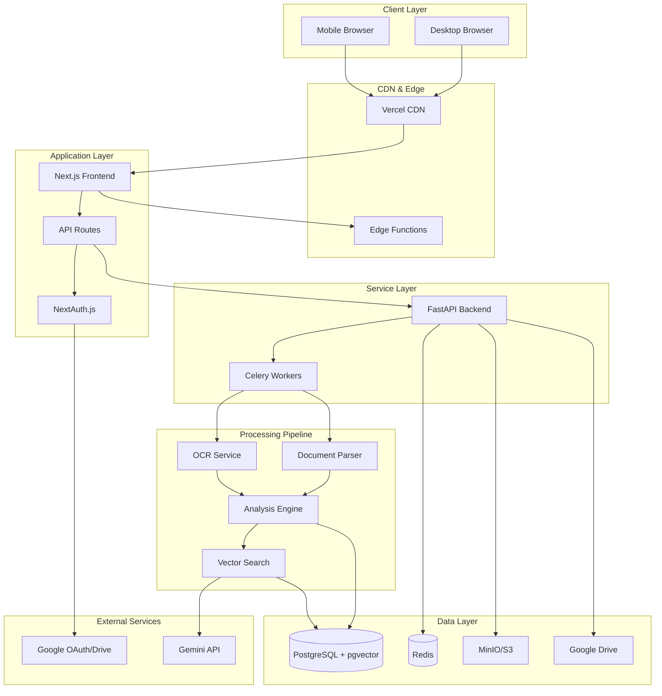
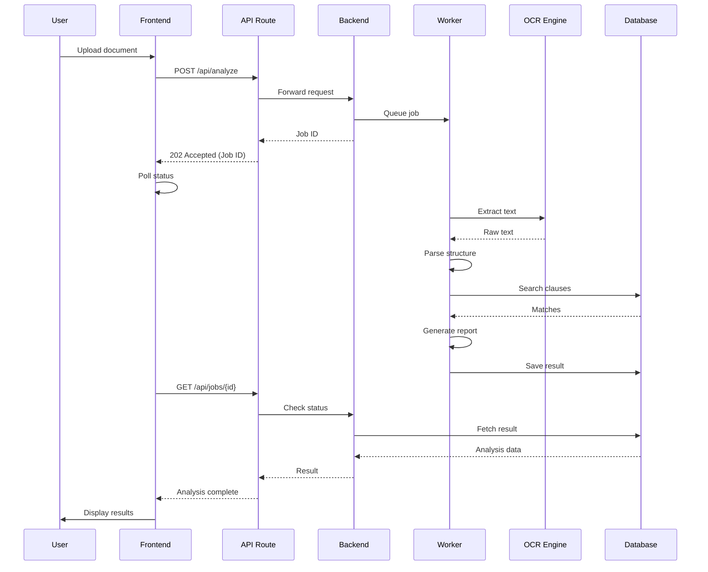

# FairPact - Implementation Plan v2.0

## Document Information
- **Version:** 2.0
- **Last Updated:** 2025-12-08
- **Status:** Planning Phase
- **Related Documents:**
  - [API Specification](./api_specification.md)
  - [Database Schema](./database_schema.md)
  - [Testing Strategy](./testing_strategy.md)
  - [Security & Compliance](./security_compliance.md)
  - [Deployment Guide](./deployment_infrastructure.md)

---

## 1. Executive Summary

**FairPact** is a contract analysis web application designed to identify prohibited clauses in legal documents using OCR and NLP technologies. The system operates in two modes:
- **Offline Mode:** Rule-based analysis using local ML models (no external API dependencies)
- **AI Mode:** Enhanced analysis using Gemini API for contextual understanding

### Key Features
- Multi-format document support (PDF, DOCX, images, camera capture)
- Real-time clause detection with visual highlighting
- Multi-language support (Polish primary, English secondary)
- Guest and authenticated user workflows
- Custom clause database management
- Privacy-first design with Google Drive integration

### Success Metrics
- **OCR Accuracy:** >95% for typed text, >85% for scanned documents
- **Clause Detection:** >90% precision, >85% recall
- **Response Time:** <5s for documents up to 10 pages
- **Uptime:** 99.5% availability
- **User Satisfaction:** NPS >50

---

## 2. Technology Stack (Revised)

### 2.1 Frontend
| Component | Technology | Justification |
|-----------|-----------|---------------|
| Framework | Next.js 14+ (App Router) | SSR, API routes, excellent DX |
| UI Library | TailwindCSS + shadcn/ui | Accessible components, customizable |
| State Management | Zustand | Lightweight, TypeScript-first |
| Forms | React Hook Form + Zod | Type-safe validation |
| File Upload | react-dropzone | Drag & drop, camera integration |
| PDF Viewer | react-pdf | Document preview |
| Icons | Lucide React | Consistent, tree-shakeable |
| Font | Inter (Google Fonts) | Excellent readability, i18n support |
| Testing | Vitest + Testing Library | Fast, modern |

### 2.2 Backend
| Component | Technology | Justification |
|-----------|-----------|---------------|
| Framework | FastAPI 0.104+ | Async, auto-docs, type hints |
| OCR | Tesseract 5+ (pol+eng) | Open source, battle-tested |
| OCR Alternative | EasyOCR | Backup for complex cases |
| PDF Parser | pdfplumber | Table extraction support |
| DOCX Parser | python-docx | Native Word format support |
| NLP (Local) | sentence-transformers | Local embeddings, no API |
| Vector Model | all-MiniLM-L6-v2 | Fast, 384-dim, multilingual |
| Vector Search | FAISS + pgvector | Hybrid local/persistent search |
| AI Integration | google-generativeai | Gemini API client |
| Task Queue | Celery + Redis | Async job processing |
| Testing | pytest + pytest-asyncio | Comprehensive testing |

### 2.3 Database & Infrastructure
| Component | Technology | Justification |
|-----------|-----------|---------------|
| Database | PostgreSQL 15+ | ACID, pgvector support |
| Vector Extension | pgvector | Native vector search |
| Cache/Queue | Redis 7+ | Session storage, Celery broker |
| File Storage (Guest) | MinIO (S3-compatible) | Self-hosted, lifecycle policies |
| File Storage (User) | Google Drive API | User owns data |
| Auth | NextAuth.js v5 | OAuth 2.0, session management |
| Monitoring | Sentry + Prometheus | Error tracking, metrics |
| Logging | Loki + Grafana | Centralized logs |

---

## 3. Architecture (Enhanced)

### 3.1 System Architecture Diagram

### 3.2 Document Processing Flow

---

## 4. Implementation Phases (Detailed)

### Phase 0: Project Foundation (Week 1)
**Goal:** Establish development environment and core infrastructure

#### Tasks:
- [x] Create monorepo structure
- [ ] **Setup Development Tooling**
  - [ ] Configure ESLint + Prettier (frontend)
  - [ ] Configure Black + isort + mypy (backend)
  - [ ] Setup pre-commit hooks (Husky)
  - [ ] Configure VSCode workspace settings
- [ ] **Environment Configuration**
  - [ ] Create `.env.example` files for both frontend/backend
  - [ ] Setup environment variable validation (Zod/Pydantic)
  - [ ] Document all required environment variables
- [ ] **Database Setup**
  - [ ] Install PostgreSQL (Docker Compose)
  - [ ] Enable pgvector extension
  - [ ] Setup Alembic for migrations
  - [ ] Create initial migration structure
- [ ] **Design System Foundation**
  - [ ] Configure Tailwind with custom color palette
  - [ ] Integrate shadcn/ui
  - [ ] Create base components (Button, Input, Card)
  - [ ] Setup dark mode toggle
- [ ] **CI/CD Pipeline**
  - [ ] GitHub Actions: Linting
  - [ ] GitHub Actions: Type checking
  - [ ] GitHub Actions: Unit tests
  - [ ] Setup branch protection rules

**Acceptance Criteria:**
- ✅ Both frontend and backend start without errors
- ✅ Database migrations run successfully
- ✅ Linting/formatting passes on all files
- ✅ CI pipeline executes successfully on PR
- ✅ Dark/light mode toggle works

**Deliverables:**
- Working dev environment
- CI/CD pipeline configured
- Base design system implemented

---

### Phase 1: Core Backend - Document Processing (Weeks 2-3)
**Goal:** Build robust document ingestion and text extraction pipeline

#### 1.1 Document Upload & Storage
- [ ] **File Upload Endpoint**
  - [ ] POST `/api/v1/documents/upload` (multipart/form-data)
  - [ ] File type validation (PDF, DOCX, JPG, PNG)
  - [ ] File size limits (10MB default, configurable)
  - [ ] Virus scanning integration (ClamAV optional)
- [ ] **Storage Service**
  - [ ] Guest storage: MinIO with 24h TTL
  - [ ] User storage: Google Drive upload
  - [ ] Secure temporary file handling
  - [ ] Cleanup cron job

#### 1.2 OCR Pipeline
- [ ] **Tesseract Integration**
  - [ ] Install Polish (`pol`) and English (`eng`) trained data
  - [ ] Image preprocessing (deskew, denoise, contrast)
  - [ ] Multi-page document handling
  - [ ] Confidence score extraction
- [ ] **Quality Detection**
  - [ ] Detect if PDF has native text layer
  - [ ] Skip OCR if text extractable directly
  - [ ] Flag low-confidence results (<80%)
- [ ] **Testing**
  - [ ] Unit tests with sample documents
  - [ ] Polish character accuracy tests (ą, ć, ę, ł, ń, ó, ś, ź, ż)
  - [ ] Performance benchmarks

#### 1.3 Document Parsing
- [ ] **PDF Parser**
  - [ ] Text extraction with layout preservation
  - [ ] Table detection and extraction
  - [ ] Metadata extraction (author, date, title)
- [ ] **DOCX Parser**
  - [ ] Paragraph and heading extraction
  - [ ] Style preservation
  - [ ] List and numbering handling
- [ ] **Structured Output**
  - [ ] JSON schema for parsed documents
  - [ ] Section/clause numbering inference
  - [ ] Confidence scoring per section

**Acceptance Criteria:**
- ✅ Successfully extracts text from 10 test documents (mix of formats)
- ✅ Polish text OCR accuracy >90% on clean scans
- ✅ Processing time <30s for 10-page document
- ✅ Structured output validates against schema

**Deliverables:**
- Document upload API
- OCR + parsing pipeline
- Test suite with 20+ test documents

---

### Phase 2: Analysis Engine (Weeks 4-5)
**Goal:** Implement clause detection using hybrid search

#### 2.1 Clause Database
- [ ] **Database Schema** (see [database_schema.md](./database_schema.md))
  - [ ] `prohibited_clauses` table with vector embeddings
  - [ ] `clause_categories` taxonomy
  - [ ] `legal_references` linking
- [ ] **Seed Data**
  - [ ] 50+ common prohibited clauses (Polish consumer law)
  - [ ] Categorization (unfair terms, hidden fees, liability waiver, etc.)
  - [ ] Legal article references (Polish Civil Code)
- [ ] **CRUD API**
  - [ ] GET `/api/v1/clauses` (list with filters)
  - [ ] POST `/api/v1/clauses` (admin/user add custom)
  - [ ] PUT `/api/v1/clauses/{id}` (update)
  - [ ] DELETE `/api/v1/clauses/{id}` (soft delete)

#### 2.2 Vector Embedding Service
- [ ] **Model Loading**
  - [ ] Download `sentence-transformers/all-MiniLM-L6-v2`
  - [ ] Implement caching mechanism
  - [ ] GPU support detection (optional CUDA)
- [ ] **Embedding Generation**
  - [ ] Batch embedding for clause database
  - [ ] Document chunk embedding (512 token sliding window)
  - [ ] Normalize vectors (L2 norm)
- [ ] **Vector Storage**
  - [ ] Store embeddings in pgvector (384 dimensions)
  - [ ] Create HNSW index for fast similarity search
  - [ ] Backup embeddings to file cache

#### 2.3 Hybrid Search Algorithm
- [ ] **Keyword Matching**
  - [ ] Polish stemming (Stempel stemmer)
  - [ ] Fuzzy matching (Levenshtein distance ≤2)
  - [ ] Phrase matching with wildcards
- [ ] **Vector Similarity**
  - [ ] Cosine similarity search (threshold >0.75)
  - [ ] Top-K retrieval (K=5)
  - [ ] Re-ranking by keyword match boost
- [ ] **Result Fusion**
  - [ ] Reciprocal Rank Fusion (RRF)
  - [ ] Confidence scoring (0-100)
  - [ ] Explanation generation (why matched)

#### 2.4 AI Enhancement (Optional Mode)
- [ ] **Gemini Integration**
  - [ ] Prompt engineering for clause analysis
  - [ ] Context window management (32K tokens)
  - [ ] Streaming response handling
- [ ] **Fallback Handling**
  - [ ] Retry logic with exponential backoff
  - [ ] Graceful degradation to local-only mode
  - [ ] Cost tracking and rate limiting

**Acceptance Criteria:**
- ✅ Clause database contains 50+ entries with embeddings
- ✅ Hybrid search achieves >85% recall on test set
- ✅ Average search latency <500ms
- ✅ AI mode provides contextual explanations

**Deliverables:**
- Clause database with seed data
- Hybrid search implementation
- Gemini integration with fallback

---

### Phase 3: Frontend Core Features (Weeks 6-7)
**Goal:** Build user-facing interface for document upload and results

#### 3.1 Upload Interface
- [ ] **Upload Component**
  - [ ] Drag & drop zone (react-dropzone)
  - [ ] File type icons and validation messages
  - [ ] Progress indicator during upload
  - [ ] Multi-file queue management
- [ ] **Camera Capture (Mobile)**
  - [ ] Access device camera API
  - [ ] Photo preview and retake
  - [ ] Image quality warning
  - [ ] Orientation auto-correction
- [ ] **Upload Options**
  - [ ] Analysis mode selector (Offline/AI)
  - [ ] Language selector (Polish/English)
  - [ ] Custom clause import

#### 3.2 Analysis View
- [ ] **Document Viewer**
  - [ ] PDF rendering with react-pdf
  - [ ] Image viewer with zoom/pan
  - [ ] Text layer overlay
- [ ] **Results Panel**
  - [ ] Split-screen layout (document | results)
  - [ ] Highlighted clause regions
  - [ ] Risk severity indicators (high/medium/low)
  - [ ] Clause details sidebar
- [ ] **Interactive Features**
  - [ ] Click clause to jump to location
  - [ ] Filter by risk level
  - [ ] Export report (PDF/JSON)
  - [ ] Share link generation

#### 3.3 Real-time Updates
- [ ] **Job Status Polling**
  - [ ] WebSocket connection (Socket.io)
  - [ ] Fallback to HTTP polling (5s interval)
  - [ ] Progress stages (upload → OCR → analysis → complete)
- [ ] **Error Handling**
  - [ ] User-friendly error messages
  - [ ] Retry mechanisms
  - [ ] Support contact information

**Acceptance Criteria:**
- ✅ Upload flow works on mobile and desktop
- ✅ Camera capture functions on iOS/Android
- ✅ Results display correctly for 10 test documents
- ✅ Real-time updates reflect processing stages
- ✅ Export generates valid PDF report

**Deliverables:**
- Complete upload + analysis UI
- Mobile-responsive design
- Export functionality

---

### Phase 4: Authentication & User Features (Week 8)
**Goal:** Implement user accounts and personalization

#### 4.1 Authentication System
- [ ] **NextAuth.js Configuration**
  - [ ] Google OAuth provider setup
  - [ ] Session strategy (JWT + database)
  - [ ] Guest session handling (anonymous ID)
  - [ ] CSRF protection
- [ ] **User Model**
  - [ ] User profile (name, email, avatar)
  - [ ] Subscription tier (free/pro)
  - [ ] Usage quotas
- [ ] **Protected Routes**
  - [ ] Middleware for auth checking
  - [ ] Redirect logic
  - [ ] API route protection

#### 4.2 Google Drive Integration
- [ ] **OAuth Scopes**
  - [ ] `drive.file` (files created by app)
  - [ ] `drive.appdata` (metadata storage)
- [ ] **Upload Flow**
  - [ ] Create "FairPact Analyses" folder
  - [ ] Upload analyzed documents
  - [ ] Store metadata (analysis results)
- [ ] **Document Management**
  - [ ] List user's analyzed documents
  - [ ] Re-analyze existing document
  - [ ] Delete from Drive

#### 4.3 User Dashboard
- [ ] **Analysis History**
  - [ ] Table view with filters
  - [ ] Search by filename/date
  - [ ] Risk summary statistics
- [ ] **Custom Clauses**
  - [ ] User-created clause library
  - [ ] Import/export clause sets
  - [ ] Share clauses with community (opt-in)
- [ ] **Settings**
  - [ ] Default analysis mode
  - [ ] Language preference
  - [ ] Email notifications
  - [ ] Account deletion (GDPR)

**Acceptance Criteria:**
- ✅ Google OAuth login works end-to-end
- ✅ Files successfully upload to user's Drive
- ✅ Guest users can access limited features
- ✅ Dashboard displays analysis history
- ✅ Custom clauses persist and apply to analyses

**Deliverables:**
- Complete authentication flow
- Google Drive integration
- User dashboard

---

### Phase 5: Polish & Optimization (Week 9)
**Goal:** Performance optimization and user experience refinement

#### 5.1 Performance Optimization
- [ ] **Frontend**
  - [ ] Image optimization (next/image)
  - [ ] Route-based code splitting
  - [ ] Lazy load heavy components
  - [ ] Implement ISR for static pages
- [ ] **Backend**
  - [ ] Database query optimization
  - [ ] Connection pooling (PgBouncer)
  - [ ] Celery task optimization
  - [ ] Response caching (Redis)
- [ ] **Vector Search**
  - [ ] Tune HNSW index parameters
  - [ ] Benchmark different similarity functions
  - [ ] Implement approximate nearest neighbor

#### 5.2 User Experience
- [ ] **Onboarding**
  - [ ] Welcome tour (react-joyride)
  - [ ] Example document analysis
  - [ ] Feature highlights
- [ ] **Feedback System**
  - [ ] "Was this helpful?" buttons
  - [ ] Report false positive/negative
  - [ ] Suggestion box
- [ ] **Accessibility**
  - [ ] WCAG 2.1 AA compliance
  - [ ] Keyboard navigation
  - [ ] Screen reader testing
  - [ ] High contrast mode

#### 5.3 Internationalization (i18n)
- [ ] **next-intl Setup**
  - [ ] Polish (pl) translations
  - [ ] English (en) translations
  - [ ] Language switcher
- [ ] **Content Translation**
  - [ ] UI strings
  - [ ] Error messages
  - [ ] Email templates
  - [ ] Clause descriptions

**Acceptance Criteria:**
- ✅ Lighthouse score >90 on all metrics
- ✅ Page load time <2s on 3G connection
- ✅ WCAG AA compliance verified
- ✅ Both languages fully translated

**Deliverables:**
- Optimized application
- Onboarding flow
- Full i18n support

---

### Phase 6: Testing & Quality Assurance (Week 10)
**Goal:** Comprehensive testing and bug fixing

#### 6.1 Test Coverage
- [ ] **Frontend Tests**
  - [ ] Component unit tests (>80% coverage)
  - [ ] Integration tests (upload flow)
  - [ ] E2E tests (Playwright)
  - [ ] Visual regression tests (Chromatic)
- [ ] **Backend Tests**
  - [ ] Unit tests (>90% coverage)
  - [ ] Integration tests (API endpoints)
  - [ ] OCR accuracy tests
  - [ ] Load tests (Locust)
- [ ] **Security Tests**
  - [ ] OWASP ZAP scan
  - [ ] Dependency vulnerability check
  - [ ] Penetration testing (manual)

#### 6.2 Bug Bash
- [ ] Internal testing session
- [ ] User acceptance testing (UAT)
- [ ] Cross-browser testing
- [ ] Mobile device testing

**Acceptance Criteria:**
- ✅ All tests passing
- ✅ Zero critical/high severity bugs
- ✅ Security scan shows no vulnerabilities

**Deliverables:**
- Complete test suite
- Bug fixes
- Security report

---

### Phase 7: Deployment & Launch (Week 11)
**Goal:** Production deployment and monitoring

#### 7.1 Infrastructure Setup
- [ ] **Production Environment**
  - [ ] Provision VPS (Hetzner)
  - [ ] Setup Docker Compose/Kubernetes
  - [ ] Configure SSL certificates (Let's Encrypt)
  - [ ] Setup CDN (Cloudflare)
- [ ] **Database**
  - [ ] Managed PostgreSQL (Supabase)
  - [ ] Automated backups (daily)
  - [ ] Replication setup
- [ ] **Monitoring**
  - [ ] Sentry error tracking
  - [ ] Prometheus + Grafana metrics
  - [ ] Uptime monitoring (UptimeRobot)
  - [ ] Log aggregation (Loki)

#### 7.2 Deployment
- [ ] **CI/CD Pipeline**
  - [ ] Automated deployments on merge to main
  - [ ] Staging environment testing
  - [ ] Zero-downtime deployment strategy
- [ ] **Launch Checklist**
  - [ ] Performance testing
  - [ ] Security audit
  - [ ] Legal review (Terms, Privacy Policy)
  - [ ] Analytics setup (PostHog/Plausible)

**Acceptance Criteria:**
- ✅ Application accessible at production URL
- ✅ All monitoring systems operational
- ✅ Automated backups verified
- ✅ Deployment pipeline functional

**Deliverables:**
- Live application
- Monitoring dashboards
- Launch announcement

---

## 5. Risk Management

### Technical Risks

| Risk | Probability | Impact | Mitigation |
|------|------------|--------|------------|
| OCR accuracy insufficient | Medium | High | Multiple OCR engines, quality detection, manual review option |
| Vector search performance | Low | Medium | HNSW indexing, query optimization, caching |
| Google Drive API limits | Low | Medium | Rate limiting, retry logic, fallback storage |
| Gemini API costs | Medium | Medium | Usage quotas, caching, optional feature |
| Database scalability | Low | High | Connection pooling, read replicas, query optimization |

### Business Risks

| Risk | Probability | Impact | Mitigation |
|------|------------|--------|------------|
| Low user adoption | Medium | High | Beta testing, feedback iteration, marketing |
| Legal liability | Low | High | Disclaimer, terms of service, lawyer review |
| Competition | Medium | Medium | Unique features, superior UX, Polish market focus |
| Operating costs | Low | Medium | Efficient architecture, usage-based pricing |

---

## 6. Success Metrics & KPIs

### Technical KPIs
- **Uptime:** 99.5% monthly
- **P95 Latency:** <3s for document analysis
- **OCR Accuracy:** >90% on test set
- **Clause Detection Recall:** >85%
- **Error Rate:** <1% of requests

### Business KPIs
- **User Acquisition:** 1000 users in first 3 months
- **Retention:** 40% MAU/WAU ratio
- **Conversion:** 5% free-to-paid conversion
- **NPS:** >50
- **Documents Analyzed:** 10,000 in first quarter

---

## 7. Post-Launch Roadmap

### Version 1.1 (Month 2)
- Clause explanation enhancements
- Bulk document analysis
- API for third-party integrations
- Mobile app (React Native)

### Version 1.2 (Month 4)
- Contract comparison feature
- Redline/track changes
- Email notifications
- Webhook support

### Version 2.0 (Month 6)
- Contract templates library
- E-signature integration
- Multi-user workspaces
- White-label solution

---

## 8. Resource Requirements

### Team
- **1x Full-stack Developer** (You)
- **1x UI/UX Designer** (Contract/Part-time)
- **1x Legal Consultant** (Contract, clause database)
- **1x QA Tester** (Contract, pre-launch)

### Budget Estimate (Monthly)
- **Infrastructure:** $50-100 (VPS, database)
- **Services:** $20-50 (domains, monitoring, APIs)
- **AI Costs:** $0-200 (Gemini usage-based)
- **Total:** $70-350/month

### Time Estimate
- **Development:** 11 weeks (phases 0-7)
- **Buffer:** 2 weeks (unexpected issues)
- **Total:** ~3 months to MVP

---

## 9. Next Steps

1. **Review & Approve** this implementation plan
2. **Prioritize** any additional features or changes
3. **Begin Phase 0** - Project foundation setup
4. **Schedule** weekly progress reviews
5. **Identify** any external dependencies or blockers

---

**Document End**
