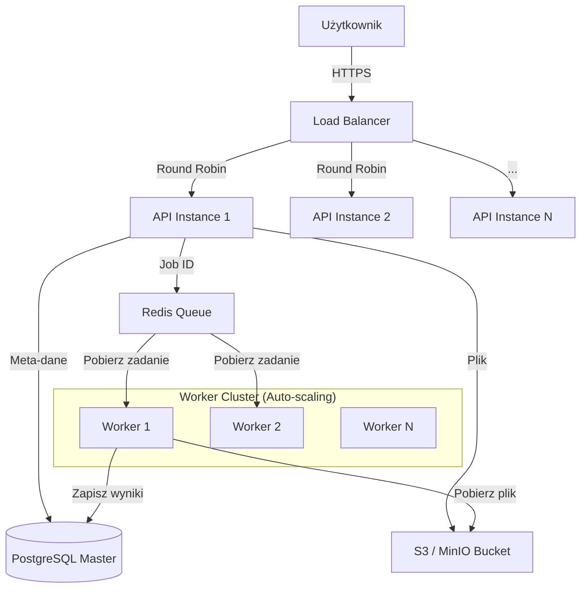

# Strategia Skalowania Aplikacji FairPact

## 1. Analiza Stanu Obecnego

### Mocne Strony
*   **Asynchroniczny Backend**: Wykorzystanie FastAPI i `sqlalchemy.ext.asyncio` pozwala na obsługę wielu równoległych zapytań I/O (np. do bazy danych).
*   **Przetwarzanie w Tle**: Ciężkie zadania (OCR, analiza klauzul) są delegowane do workerów Celery wykorzystujących kolejkę Redis. To kluczowe dla skalowalności – API nie blokuje się podczas analizy dokumentu.
*   **Architektura Mikroserwisowa**: Logiczne odseparowanie API, Workerów, Bazy Danych i Magazynu Plików (MinIO/S3).

### Wąskie Gardła (Bottlenecks)
*   **Blokujące Operacje I/O**: W obecnym kodzie API (`backend/api/documents.py`), wysyłanie pliku do MinIO odbywa się synchronicznie wewnątrz asynchronicznego endpointu. To może blokować pętlę zdarzeń (Event Loop) FastAPI przy dużym obciążeniu.
*   **Brak Load Balancera**: Obecna konfiguracja Docker Compose wystawia API bezpośrednio na porcie hosta.
*   **Pojedynczy Worker**: Domyślna konfiguracja uruchamia jedną instancję workera Celery.

## 2. Plan Rozwoju Architektury (High-Level)

Aby obsłużyć dużą liczbę użytkowników i dokumentów, proponujemy przejście na architekturę w pełni rozproszoną, zarządzaną przez orkiestrator containerów (np. Kubernetes lub Docker Swarm, ew. AWS ECS).

### Komponenty Architektury

1.  **Global Load Balancer (GLB)**
    *   **Rola**: Punkt wejścia dla całego ruchu.
    *   **Zadania**: Terminacja SSL/TLS, routing do odpowiednich usług, ochrona przed DDoS (np. AWS ALB, Cloudflare).

2.  **API Layer (Auto-Scaling Group)**
    *   **Technologia**: Kontenery FastAPI.
    *   **Skalowanie**: Horyzontalne (poziome). Liczba instancji rośnie wraz z użyciem CPU/RAM.
    *   **Optymalizacja**: Usunięcie blokujących wywołań I/O (przejście na asynchronicznego klienta S3 lub `run_in_executor`).

3.  **Task Queue (Redis/RabbitMQ)**
    *   **Rola**: Bufor dla zadań przetwarzania dokumentów.
    *   **Zarządzanie**: Managed Redis (np. AWS ElastiCache) dla wysokiej dostępności i persystencji.

4.  **Worker Layer (Auto-Scaling Group)**
    *   **Technologia**: Kontenery Celery Worker.
    *   **Skalowanie**: **Kluczowy element**. Skalowanie oparte na **metryce długości kolejki (Queue Depth)**. Jeśli w kolejce czeka > 100 dokumentów, uruchamiane są kolejne kontenery workerów.
    *   **Specjalizacja**: Możliwość podziału na kolejki priorytetowe (np. 'fast' dla małych plików tekstowych, 'heavy' dla dużych PDF z OCR).

5.  **Data Storage Layer**
    *   **Database**: PostgreSQL zpgvector. Wdrożenie w trybie Master-Replica lub wykorzystanie usług zarządzanych (AWS RDS). Connection Pooling (PgBouncer) jest niezbędny przy dużej liczbie workerów i instancji API.
    *   **Object Storage**: S3 / MinIO Gateway. Skalowalność praktycznie nieograniczona.

## 3. Szczegółowy Plan Wdrożenia

### Faza 1: Optymalizacja Kodu (Przygotowanie)
Zanim zaczniemy skalować infrastrukturę, musimy upewnić się, że kod jest "async-native".
1.  **Asynchroniczny Upload**: Zmiana `storage_service.upload_file` na wykorzystującą `run_in_executor` lub bibliotekę `aioboto3`.
2.  **Health Checks**: Dodać dedykowane endpointy `/health/live` (czy działa) i `/health/ready` (czy gotowy do przyjęcia ruchu - np. czy baza połączona).

### Faza 2: Konteneryzacja Produkcyjna
1.  Optymalizacja obrazów Docker (multi-stage builds, minimal base images).
2.  Konfiguracja zmiennych środowiskowych dla dynamicznego discovery usług.

### Faza 3: Infrastruktura Skalowalna
Przykładowa konfiguracja w środowisku chmurowym (np. AWS):
*   **Load Balancer**: Application Load Balancer (ALB).
*   **ECS Service (API)**: Min. 2 zadania, auto-scaling CPU > 70%.
*   **ECS Service (Workers)**: Skalowanie oparte o CloudWatch Alarm (ilość wiadomości w kolejce Redis).
*   **Baza Danych**: Amazon RDS for PostgreSQL.

## 4. Diagram Przepływu Danych (Skalowalny)

## 5. Strategia "Zero Downtime"
*   **Rolling Updates**: Wdrażanie nowych wersji API stopniowo, wymieniając instancje jedna po drugiej, aby zawsze część systemu była dostępna.
*   **Graceful Shutdown**: Workery Celery muszą kończyć przetwarzanie obecnego dokumentu przed wyłączeniem (SIGTERM handling).

## 6. Co robić w razie nagłego skoku ruchu (Traffic Spikes)?
System automatycznie zareaguje:
1.  API wzrośnie liczbą instancji, aby przyjąć uploady.
2.  Kolejka Redis zadziała jak bufor - użytkownicy otrzymają "Job ID" natychmiast, a status będzie "queued".
3.  Cluster Workerów zauważy rosnącą kolejkę i zacznie dokładać maszyny, aby rozładować zator.
4. Dzięki temu system **nie padnie**, jedynie czas oczekiwania na wynik analizy może się tymczasowo wydłużyć.

## 7. Wersjonowanie (Versioning)
Aby bezpiecznie rozwijać aplikację bez psucia integracji dla starszych klientów:

### Wersjonowanie API
*   **URI Versioning**: Utrzymanie prefiksu w ścieżce, np. `/api/v1/...`.
*   **Wsteczna Kompatybilność**: Zmiany w istniejących endpointach nie mogą usuwać pól ani zmieniać ich typu.
*   **Nowe Funkcje**: Dodawane są jako nowe pola (opcjonalne) lub nowe endpointy.
*   **Deprecation Policy**: Stare wersje (np. v1) są oznaczane jako "deprecated" z nagłówkiem HTTP `Warning` i usuwane dopiero po np. 6 miesiącach od wydania v2.

### Wersjonowanie Aplikacji (SemVer)
*   Stosujemy Semantic Versioning (MAJOR.MINOR.PATCH).
*   **Docker Tags**: Obraz kontenera jest tagowany numerem wersji (np. `fairpact/backend:1.2.0`) oraz hash commita (`:git-sha`). Nigdy nie używać tagu `:latest` na produkcji.

## 8. CI/CD Pipeline (Continuous Integration / Deployment)
Proces automatyzacji wdrażania zmian:

### Build Stage (CI)
Uruchamiany przy każdym Pull Request:
1.  **Lint & Type Check**: `ruff`, `mypy`.
2.  **Unit Tests**: `pytest` (mockowanie bazy danych i serwisów zewn.).
3.  **Build Docker Image**: Budowa obrazu testowego.

### Deploy Stage (CD)
Uruchamiany po merge do `main`:
1.  **Push to Registry**: Wypchnięcie obrazu do ECR/Docker Hub z nowym tagiem.
2.  **Database Migration**: Uruchomienie `alembic upgrade head` (jako osobny Job przed startem nowej wersji aplikacji chmura).
3.  **Rolling Update**: Orkiestrator (np. K8s) powoli podmienia pody v1.1 na v1.2.
4.  **Health Check**: Jeśli nowe pody nie wstaną (fail health check), automatyczny Rollback.

## 9. Synchronizacja Danych (External Data Sync)
Backend musi regularnie aktualizować bazę klauzul zakazanych z zewnętrznego rejestru (np. UOKiK).

### Rozwiązanie: Celery Beat (Scheduled Tasks)
Wykorzystamy **Celery Beat** do harmonogramowania zadań cyklicznych.

1.  **Nowy Task**: `tasks.sync.sync_prohibited_clauses`.
2.  **Harmonogram**: Uruchamianie np. raz dziennie o 3:00 w nocy.
3.  **Logika (Idempotentność)**:
    *   Pobierz ostatnie wpisy ze źródła zewnętrznego (API lub scraping).
    *   Dla każdego wpisu sprawdź, czy istnieje już w naszej bazie (np. po unikalnym ID zewnętrznym lub hashu treści klauzuli).
    *   Jeśli **nie istnieje**: Dodaj do bazy `Clause` i oznacz jako `newly_added`.
    *   (Opcjonalnie) Wyślij powiadomienie do administratora o nowych klauzulach.
4.  **Raportowanie**: Wynik synchronizacji (ilość dodanych/zmienionych) zapisywany w logach lub tabeli `SystemEvents`.

To podejście zapewnia, że nasza baza jest zawsze "świeża", a proces nie wpływa na wydajność API obsługującego użytkowników (działa w tle).
